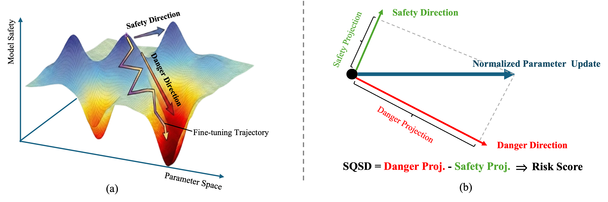

# From Parameter Dynamics to Risk Scoring: Quantifying Sample-Level Safety Degradation in LLM Fine-tuning

> [[Paper]](https://arxiv.org/abs/2605.04572) · [[Weights (Qwen3-8B)]](https://huggingface.co/Wxxxx/SQSD)
> This paper is accepted by ICML2026（Regular）
---

## Overview

Safety alignment of LLMs is fragile, fine-tuning on a few benign samples can severely erode safety behaviors. This work makes two key contributions:
 
1. **Mechanistic Analysis (Parameter Dynamics)**: We uncover why benign fine-tuning degrades safety by tracking parameter trajectories throughout training. We find that **model parameters cumulatively drift toward danger-aligned directions**, progressively undermining safety, even when the training data contains no explicitly harmful content.
2. **Sample-Level Risk Quantification (SQSD)**: Motivated by the above finding, we propose SQSD which assigns a continuous risk score to training sample by measuring how much its induced parameter update pushes the model toward danger versus safety directions in parameter space.
<p align="center">
  
</p>


### SQSD

For a training sample z, SQSD computes a module-wise normalized projection gap and aggregates across all LoRA modules:

```math
\text{SQSD}(z) = \sum_{m} \left[ \left\langle \frac{\Delta W_m(z)}{\|\Delta W_m(z)\|_2},\ \hat{V}_{\text{danger},m} \right\rangle - \left\langle \frac{\Delta W_m(z)}{\|\Delta W_m(z)\|_2},\ \hat{V}_{\text{safety},m} \right\rangle \right]
```

where $\Delta W_m(z)$ is the parameter update induced by sample z via one-step gradient descent, and $\hat{V}_{\text{danger}}$, $\hat{V}_{\text{safety}}$ are the L2-normalized danger and safety direction vectors. A higher score indicates the sample drives the model toward dangerous parameter states.

### Key Properties

- **Continuous quantification**: Provides a risk score for every sample rather than discrete subset labeling, avoiding the boundary collapse problem of extreme-sample selection.
- **Parameter-space operation**: Identifies high-risk benign samples that evade traditional toxicity classifiers.
- **Strong transferability**: Scores transfer across model architectures, parameter scales, and fine-tuning methods (LoRA → Full Fine-tuning).

---

## Installation

```bash
git clone https://github.com/Jason-wx/SQSD
cd SQSD
pip install -r requirement.txt
```

---

## Preparation: Direction Weights and Initialization Checkpoints

SQSD requires two types of pre-computed weights. Download them from the corresponding HuggingFace weight repositories and place them under `./weights/`:

**Direction weights** encode the safety and danger directions in parameter space. They are constructed as parameter displacements from the base model to fine-tuned states (see Section 3.1 of the paper):

| Direction | Type | Construction | Dataset |
|-----------|------|-------------|---------|
| `Ageis_Danger` | Danger | SFT on harmful data | Aegis-unsafe (3k) |
| `Beaver-Danger` | Danger | SFT on harmful data | BeaverTails-unsafe (3k) |
| `PKURLHF-10K_Safety` | Safety | DPO on alignment data | PKU-SafeRLHF-10K |

**Initialization checkpoints** determine the parameter state at which SQSD is computed. SQSD's effectiveness is parameter-state-dependent; reliable risk quantification requires initializing at high directional sensitivity states (see Section 4.3):

| Direction | Initialization | Checkpoint |
|-----------|---------------|------------|
| Danger | Drift-enhanced sensitivity: $\theta_{\text{initial}} = \theta_{t^*}$ | Fine-tuning checkpoint with highest sensitivity (e.g., `dolly_ckpt_5850` for Qwen3-8B) |
| Safety | Linear-path sensitivity: $\theta_{\text{initial}} = \theta_0 + \alpha^* \cdot V_{\text{safety}}$ | Base model + safety direction vector (no extra checkpoint needed; $\alpha^*=0.5$（scale_overide = 1.0） for Qwen3-8B) |

Pre-computed weights for Qwen3-8B experiments are provided at [[Weights (Qwen3-8B)]](https://huggingface.co/Wxxxx/SQSD).

---

## Usage

### Step 1: Compute Safety Direction Projection

Computes each sample's projection score onto the safety direction. Initialization uses linear-path sensitivity: θ_0 + α\*·V_safety.

```bash
bash script/projection_grad_vector_qwen3_scale_initial.sh
```

Output: per-sample projection scores onto the safety direction.

### Step 2: Compute Danger Direction Projection

Computes each sample's projection score onto the danger direction. Initialization uses a high-sensitivity fine-tuning checkpoint (drift-enhanced sensitivity).

```bash
bash script/projection_grad_vector_qwen3_check-initial.sh
```

Output: per-sample projection scores onto the danger direction.

### Step 3: Compute SQSD Scores and Sample Subsets

Computes final SQSD scores as `Danger_Proj − Safety_Proj`, sorts samples by score, and uniformly samples 5 subsets (S1–S5, 1000 samples each):

```bash
bash script/process_data.sh
```

| Subset | Risk Level |
|--------|-----------|
| S1 | Highest risk |
| S2 | High risk |
| S3 | Medium risk |
| S4 | Low risk |
| S5 | Lowest risk |

### Step 4: Fine-tune and Generate Responses

Fine-tunes models on each subset using [LLaMA-Factory](https://github.com/hiyouga/LLaMA-Factory) and generates responses for evaluation.

```bash
bash script/generate_Qwen3.sh
```

### Step 5: Evaluate Safety

Computes ASR (Attack Success Rate) using LlamaGuard3-8B and Safety Score using beaver-7b-unified-cost on CategoricalHarmfulQA, AdvBench, and HEx-PHI.

```bash
bash script/get_safescore_asr.sh
```

---

## Main Results

SQSD demonstrates consistent superiority in quantifying sample-level fine-tuning risk. Models fine-tuned on SQSD-ranked subsets exhibit **monotonically decreasing ASR in 10/12 settings**, and SQSD achieves the largest average ASR gap between highest- and lowest-risk subsets (49.86%) across all configurations, significantly outperforming baselines (best baseline: 43.76%).

SQSD also exhibits strong **transferability** across:
- Model architectures (Qwen3-8B ↔ Llama-3.1-8B-Instruct)
- Parameter scales (8B → 14B / 32B)
- Fine-tuning methods (LoRA → Full Fine-tuning)

For full experimental results, see Tables 1–3 of the paper.

---

## Citation

```bibtex
@article{wang2025sqsd,
  title={From Parameter Dynamics to Risk Scoring: Quantifying Sample-Level Safety Degradation in LLM Fine-tuning},
  author={Wang, Xiao and Zhang, Yifei and Liu, YongKang and Yang, Xiaocui and Wang, Zihan and Feng, Shi and Wang, Daling},
  journal={arXiv preprint arXiv:2605.04572},
  year={2025}
}
```
